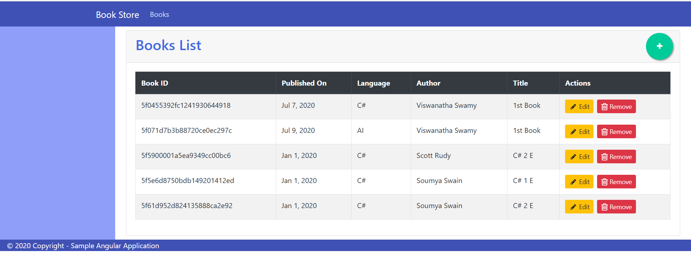

# Sample Mini Projects

## 1. Output of gRPC Server and Client in .Net Core, Node JS, Python

### 1.1. Angular 10 UI

'
'
'
'
'

### 1.2. Web API

*********************************************************************************************************************************************************************

## 2. Simple gRPC Server and Client in .Net Core, Node JS, Python, GoLang

### 2.1. gRPC Server and Client in **.Net Core C#**

### 2.2. gRPC Server and Client in **Node JS**

### 2.3. gRPC Server and Client in **Python**

### 2.4. gRPC Server and Client in **GoLang**

