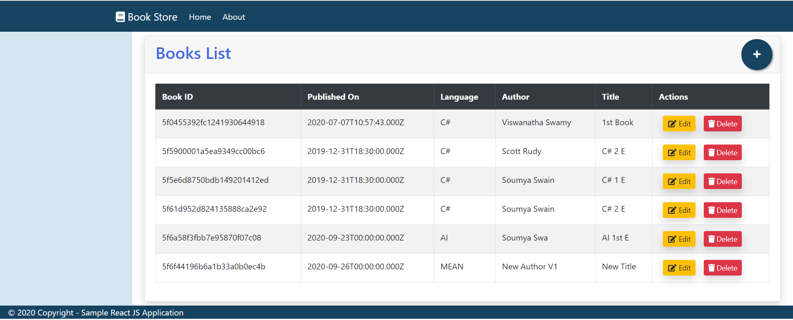

# Mini Projects

## 1. [books-store MEAN stack Application](https://github.com/vishipayyallore/mini-projects-2020/tree/master/Projects/books-store)

## 2. [Simple gRPC Server and Client in **A.** .Net Core, **B.** Node JS, **C.** Python, **D.** GoLang](https://github.com/vishipayyallore/mini-projects-2020/tree/master/Projects/grpc-helloworld)

## 3. [books-store MERN stack Application](https://github.com/vishipayyallore/mini-projects-2020/tree/master/Projects/book-store-mern)

## 4. [college progessors .Net Core and Angular 10 Full stack Application](https://github.com/vishipayyallore/mini-projects-2020/tree/master/Projects/fullstack-.netcore-angular)

*************************************************************************************************************************************

## Application Look and Feel

### 1. books-store **MEAN** stack Application

*************************************************************************************************************************************

### 2. gRPC Server and Client in **Node JS**

*************************************************************************************************************************************

### 3. books-store **MERN** stack Application

*************************************************************************************************************************************

### 4. college progessors **.Net Core and Angular 10** stack Application

